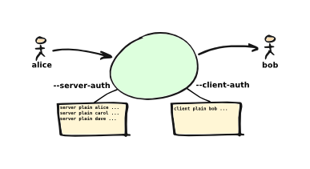

*********
Reference
*********

Command line usage
==================
The *emailrelay* program supports the following command-line usage:

::

    emailrelay [<option> [<option> ...]] [<config-file>]

Basic options
-------------

*   --as-client \<host:port\> (-q)

    This is equivalent to *--log*, *--no-syslog*, *--no-daemon*, *--dont-serve*,
    *--forward* and *--forward-to*. It is a convenient way of running a
    forwarding agent that forwards spooled mail messages and then terminates.

*   --as-proxy \<host:port\> (-y)

    This is equivalent to *--log*, *--close-stderr*, *--forward-on-disconnect*
    and *--forward-to*. It is a convenient way of running a store-and-forward
    daemon. Use *--log*, *--forward-on-disconnect* and *--forward-to* instead
    of *--as-proxy* to keep the standard error stream open.

*   --as-server (-d)

    This is equivalent to *--log* and *--close-stderr*. It is a convenient way of
    running a background storage daemon that accepts mail messages and spools
    them. Use *--log* instead of *--as-server* to keep the standard error
    stream open.

*   --spool-dir \<dir\> (-s)

    Specifies the directory used for holding mail messages that have been
    received but not yet forwarded.

*   --help (-h)

    Displays help text and then exits. Use with *--verbose* for more complete
    output.

*   --version (-V)

    Displays version information and then exits.

SMTP client options
-------------------

*   --client-smtp-config \<config\> (-c)

    Configures the SMTP_ client protocol using a comma-separated list of optional
    features, including 'pipelining', 'smtputf8strict', 'eightbitstrict' and
    'binarymimestrict'.

*   --forward (-f)

    Causes spooled mail messages to be forwarded when the program first starts.

*   --forward-on-disconnect (-1)

    Causes spooled mail messages to be forwarded whenever a SMTP client
    connection disconnects.

*   --forward-to \<host:port\> (-o)

    Specifies the transport address of the remote SMTP_ server that spooled mail
    messages are forwarded to.

*   --poll \<period\> (-O)

    Causes forwarding of spooled mail messages to happen at regular intervals
    (with the time given in seconds).

*   --client-filter \<program\> (-Y)

    Runs the specified external filter program whenever a mail message is
    forwarded. The filter is passed the name of the message file in the spool
    directory so that it can edit it as required. A network filter can be
    specified as *net:\<tcp-address\>* and prefixes of *spam:*, *spam-edit:* and
    *exit:* are also allowed. The *spam:* and *spam-edit:* prefixes require a
    SpamAssassin daemon to be running. For store-and-forward applications the
    *--filter* option is normally more useful than *--client-filter*.

*   --client-interface \<ip-address\> (-6)

    Specifies the IP network address to be used to bind the local end of outgoing
    SMTP_ connections. By default the address will depend on the routing tables
    in the normal way. Use *0.0.0.0* to use only IPv4 addresses returned from
    DNS lookups of the *--forward-to* address, or *::* for IPv6.

*   --connection-timeout \<time\> (-U)

    Specifies a timeout (in seconds) for establishing a TCP connection to remote
    SMTP servers. The default is 40 seconds.

*   --idle-timeout \<time\>

    Specifies a timeout (in seconds) for receiving network traffic from remote
    SMTP_ and POP_ clients. The default is 60 seconds.

*   --response-timeout \<time\> (-T)

    Specifies a timeout (in seconds) for getting responses from remote SMTP
    servers. The default is 60 seconds.

*   --forward-to-all

    Requires all recipient addresses to be accepted by the remote server before
    forwarding. This is currently the default behaviour so this option is for
    forwards compatibility only.

*   --forward-to-some

    Allow forwarding to continue even if some recipient addresses on an e-mail
    envelope are rejected by the remote server.

*   --immediate (-m)

    Causes mail messages to be forwarded as they are received, even before they
    have been accepted. This can be used to do proxying without
    store-and-forward, but in practice clients tend to to time out while
    waiting for their mail message to be accepted.

SMTP server options
-------------------

*   --port \<port\> (-p)

    Sets the port number used for listening for incoming SMTP_ connections.

*   --remote-clients (-r)

    Allows incoming connections from addresses that are not local. The default
    behaviour is to reject connections that are not local in order to prevent
    accidental exposure to the public internet, although a firewall should also
    be used. Local address ranges are defined in RFC-1918_, RFC-6890 etc.

*   --address-verifier \<program\>

    Runs the specified external program to verify a message recipient's e-mail
    address. A network verifier can be specified as *net:\<tcp-address\>*. The
    *account:* built-in address verifier can be used to check recipient
    addresses against the list of local system account names.

*   --anonymous[=\<scope\>] (-A)

    Disables the server's SMTP_ VRFY command, sends less verbose SMTP greeting and
    responses, stops *Received* lines being added to mail message content
    files, and stops the SMTP client protocol adding *AUTH=* to the *MAIL*
    command. For finer control use a comma-separated list of things to
    anonymise: *vrfy*, *server*, *content* and/or *client*.

*   --delivery-dir \<dir\> (-s)

    Specifies the base directory for mailboxes when delivering messages that have
    local recipients. This defaults to the main spool directory.

*   --dnsbl \<config\>

    Specifies a list of DNSBL_ servers that are used to reject SMTP_ connections
    from blocked addresses. The configuration string is made up of
    comma-separated fields: the list of DNSBL servers, an optional rejection
    threshold, an optional timeout in milliseconds, and optionally the
    transport address of the DNS server.

*   --domain \<fqdn\> (-D)

    Specifies the domain name that is used in SMTP client EHLO commands, server
    EHLO responses, *Received* lines, and for generating authentication
    challenges. The SMTP client will use an IP address in the EHLO command if
    the given domain is not a dotted FQDN. If this option is not used at all
    then the default value is the canonical name returned from a DNS query of
    the local hostname, or the system's FQDN on Windows.

*   --filter \<program\> (-z)

    Runs the specified external filter program whenever a mail message is stored.
    The filter is passed the name of the message file in the spool directory so
    that it can edit it as required. The mail message is rejected if the filter
    program terminates with an exit code between 1 and 99. Use
    *net:\<tcp-address\>* to communicate with a filter daemon over the network,
    or *spam:\<tcp-address\>* for a spamassassin spamd daemon to accept or reject
    mail messages, or *spam-edit:\<tcp-address\>* to have spamassassin edit the
    message content without rejecting it, or *exit:\<number\>* to emulate a
    filter program that just exits.

*   --filter-timeout \<time\> (-W)

    Specifies a timeout (in seconds) for running a *--filter* program. The
    default is 60 seconds.

*   --interface \<ip-address-list\> (-I)

    Specifies the IP network addresses or interface names used to bind listening
    ports. By default listening ports for incoming SMTP_, POP_ and administration
    connections will bind the 'any' address for IPv4 and for IPv6, ie.
    *0.0.0.0* and *::*. Multiple addresses can be specified by using the option
    more than once or by using a comma-separated list. Use a prefix of *smtp=*,
    *pop=* or *admin=* on addresses that should apply only to those types of
    listening port. Any link-local IPv6 addresses must include a zone name or
    scope id.  Interface names can be used instead of addresses, in which case
    all the addresses associated with that interface at startup will used for
    listening. When an interface name is decorated with a *-ipv4* or *-ipv6*
    suffix only their IPv4 or IPv6 addresses will be used (eg. *ppp0-ipv4*).
    To inherit listening file descriptors from the parent process on unix use a
    syntax like this: *--interface=smtp=fd#3*.

*   --prompt-timeout \<time\> (-w)

    Specifies a timeout (in seconds) for getting the initial prompt from a remote
    SMTP_ server. If no prompt is received after this time then the SMTP dialog
    goes ahead without it.

*   --server-smtp-config \<config\> (-Z)

    Configures the SMTP server protocol using a comma-separated list of optional
    features, including 'pipelining', 'chunking', 'smtputf8', 'smtputf8strict',
    'nostrictparsing' and 'noalabels'.

*   --size \<bytes\> (-M)

    Limits the size of mail messages that can be submitted over SMTP_.

POP server options
------------------

*   --pop (-B)

    Enables the POP_ server, listening by default on port 110, providing access to
    spooled mail messages. Negotiated TLS_ using the POP *STLS* command will be
    enabled if the *--server-tls* option is also given.

*   --pop-by-name (-J)

    Modifies the POP server's spool directory to be the sub-directory with the
    same name as the user-id used for POP authentication. This allows POP
    clients to see only their own messages after they have been moved into
    separate sub-directories, typically by the built-in *deliver:* or *copy:*
    filters. Content files can remain in the main spool directory to save disk
    space; they will be deleted by the POP_ server when it deletes the last
    matching envelope file.

*   --pop-no-delete (-G)

    Disables the POP DELE command so that the command appears to succeed but mail
    messages are not deleted from the spool directory.

*   --pop-port \<port\> (-E)

    Sets the POP server's listening port number.

Admin server options
--------------------

*   --admin \<port\> (-a)

    Enables an administration interface on the specified listening port number.
    Use telnet or something similar to connect. The administration interface
    can be used to trigger forwarding of spooled mail messages if the
    *--forward-to* option is used.

*   --admin-terminate (-Q)

    Enables the *terminate* command in the administration interface.

Authentication options
----------------------

*   --client-auth \<file\> (-C)

    Enables SMTP_ client authentication with the remote server, using the account
    details taken from the specified secrets file. The secrets file should
    normally contain one line having between four and five space-separated
    fields. The first field must be *client*, the second field is the password
    type (*plain* or *md5*), the third is the xtext_-encoded user-id and the
    fourth is the xtext-encoded password. Alternatively, the user-id and
    password fields can be Base64_ encoded if the second field is *plain:b*. It
    is also possible to do without a secrets file and give the Base64 encoded
    user-id and password directly on the command-line or in the configuration
    file formatted as *plain:\<base64-user-id\>:\<base64-password\>*. Note that
    putting these account details on the command-line is not recommended
    because it will make the password easily visible to all users on the local
    machine.

*   --client-auth-config \<config\>

    Configures the SMTP_ client authentication module using a semicolon-separated
    list of configuration items. Each item is a single-character key, followed
    by a colon and then a comma-separated list. A 'm' character introduces an
    ordered list of preferred authentication mechanisms and an 'x' introduces a
    list of mechanisms to avoid. An 'a' list and a 'd' list can be used
    similarly to prefer and avoid certain mechanisms once the session is
    encrypted with TLS_.

*   --server-auth \<file\> (-S)

    Enables SMTP server authentication of remote SMTP clients. Account names and
    passwords are taken from the specified secrets file. The secrets file
    should contain lines that have four space-separated fields, starting with
    *server* in the first field; the second field is the password encoding
    (*plain* or *md5*), the third is the client user-id and the fourth is the
    password. The user-id is RFC-1891_ xtext_ encoded, and the password is either
    xtext encoded or generated by *emailrelay-passwd*. Alternatively, the
    username and password can be Base64_ encoded if the second field is
    \ *plain:b*\ . A special value of *pam:* can be used for authentication using
    linux PAM_.

*   --server-auth-config \<config\>

    Configures the SMTP_ server authentication module using a semicolon-separated
    list of configuration items. Each item is a single-character key, followed
    by a colon and then a comma-separated list. A 'm' character introduces an
    ordered list of allowed authentication mechanisms and an 'x' introduces a
    list of mechanisms to deny. An 'a' list and a 'd' list can be used
    similarly to allow and deny mechanisms once the session is encrypted with
    TLS_. In typical usage you might have an empty allow list for an unencrypted
    session and a single preferred mechanism once encrypted, *m:;a:plain*.

*   --pop-auth \<file\> (-F)

    Specifies a file containing valid POP_ account details. The file format is the
    same as for the SMTP_ server secrets file, ie. lines starting with *server*,
    with user-id and password in the third and fourth fields. A special value
    of *pam:* can be used for authentication using linux PAM_.

TLS options
-----------

*   --client-tls (-j)

    Enables negotiated TLS_ for outgoing SMTP_ connections; the SMTP STARTTLS
    command will be issued if the remote server supports it.

*   --client-tls-certificate \<pem-file\>

    Defines the TLS certificate file when acting as a SMTP client. This file must
    contain the client's private key and certificate chain using the PEM file
    format. Alternatively, use this option twice with the first one specifying
    the key file and the second the certificate file. Keep the file permissions
    tight to avoid accidental exposure of the private key.

*   --client-tls-connection (-b)

    Enables the use of a TLS_ tunnel for outgoing SMTP_ connections. This is for
    SMTP over TLS (SMTPS), not TLS negotiated within SMTP using STARTTLS.

*   --client-tls-required

    Makes the use of TLS mandatory for outgoing SMTP connections. The SMTP
    STARTTLS command will be used before mail messages are sent out. If the
    remote server does not allow STARTTLS then the SMTP connection will fail.

*   --client-tls-server-name \<hostname\>

    Defines the target server hostname in the TLS_ handshake. With
    *--client-tls-connection* this can be used for SNI, allowing the remote
    server to adopt an appropriate identity.

*   --client-tls-verify \<ca-list\>

    Enables verification of the remote SMTP_ server's certificate against any of
    the trusted CA certificates in the specified file or directory. In many use
    cases this should be a file containing just your self-signed root
    certificate. Specify *\<default\>* (including the angle brackets) for the TLS
    library's default set of trusted CAs.

*   --client-tls-verify-name \<cname\>

    Enables verification of the CNAME within the remote SMTP server's
    certificate.

*   --server-tls (-K)

    Enables TLS_ for incoming SMTP_ and POP_ connections. SMTP clients can then
    request TLS encryption by issuing the STARTTLS command. The
    *--server-tls-certificate* option must be used to define the server
    certificate.

*   --server-tls-certificate \<pem-file\>

    Defines the TLS certificate file when acting as a SMTP or POP server. This
    file must contain the server's private key and certificate chain using the
    PEM file format. Alternatively, use this option twice with the first
    specifying the key file and the second the certificate file. Keep the file
    permissions tight to avoid accidental exposure of the private key.

*   --server-tls-connection

    Enables SMTP_ over TLS_ when acting as an SMTP server. This is for SMTP over
    TLS (SMTPS), not TLS negotiated within SMTP using STARTTLS.

*   --server-tls-required

    Makes the use of TLS mandatory for any incoming SMTP and POP_ connections.
    SMTP clients must use the STARTTLS command to establish a TLS session
    before they can issue SMTP AUTH or SMTP MAIL-TO commands.

*   --server-tls-verify \<ca-list\>

    Enables verification of remote SMTP_ and POP clients' certificates against any
    of the trusted CA certificates in the specified file or directory. In many
    use cases this should be a file containing just your self-signed root
    certificate. Specify *\<default\>* (including the angle brackets) for the TLS_
    library's default set of trusted CAs.

*   --tls-config \<options\> (-9)

    Selects and configures the low-level TLS library, using a comma-separated
    list of keywords. If OpenSSL and mbedTLS are both built in then keywords of
    *openssl* and *mbedtls* will select one or the other. Keywords like
    *tlsv1.0* can be used to set a minimum TLS protocol version, or *-tlsv1.2*
    to set a maximum version.

Process options
---------------

*   --dont-serve (-x)

    Disables all network serving, including SMTP_, POP_ and administration
    interfaces. The program will terminate as soon as any initial forwarding is
    complete.

*   --localedir \<dir\>

    Enables localisation and specifies the locale base directory where message
    catalogues can be found. An empty directory can be used for the built-in
    default. Unix only.

*   --no-daemon (-t)

    Disables the normal backgrounding at startup so that the program runs in the
    foreground, without forking or detaching from the terminal. Unix only.

*   --hidden (-H)

    Hides the application window and disables all message boxes, overriding any
    *--show* option. This is useful when running as a windows service. Windows
    only.

*   --no-smtp (-X)

    Disables listening for incoming SMTP_ connections.

*   --pid-file \<path\> (-i)

    Causes the process-id to be written into the specified file when the program
    starts up, typically after it has become a background daemon. The immediate
    parent directory is created if necessary.

*   --user \<username\> (-u)

    When started as root the program switches to a non-privileged effective
    user-id when idle or when running external filter scripts and address
    verifiers. This option can be used to define the non-privileged user-id. It
    also determines the group ownership of new files and sockets if the
    directory owner is not 'sticky'. Specify *root* to disable all user-id
    switching. Unix only.

*   --show \<style\>

    Starts the application window in the given style: *hidden*, *popup*,
    \ *window*\ , *window,tray*, or *tray*. Ignored if also using *--no-daemon* or
    \ *--hidden*\ . If none of *--window*, *--no-daemon* and *--hidden* are used
    then the default style is *tray*. Windows only.

Logging options
---------------

*   --verbose (-v)

    Enables more verbose logging when used with *--log*, and more verbose help
    when used with *--help*.

*   --log (-l)

    Enables logging to the standard error stream and to the system log. The
    *--close-stderr* and *--no-syslog* options can be used to disable output to
    standard error stream and the system log separately. Note that
    \ *--as-server*\ , *--as-client* and *--as-proxy* imply *--log*, and
    *--as-server* and *--as-proxy* also imply *--close-stderr*.

*   --debug (-g)

    Enables debug level logging, if built in. Debug messages are usually only
    useful when cross-referenced with the source code and they may expose
    plain-text passwords and mail message content.

*   --log-address

    Adds the network address of remote clients to the logging output. Equivalent
    to *--log-format=address*.

*   --log-file \<file\> (-N)

    Redirects standard-error logging to the specified file. Logging to the log
    file is not affected by *--close-stderr*. The filename can include *%d* to
    get daily log files; the *%d* is replaced by the current date in the local
    timezone using a *YYYYMMDD* format.

*   --log-format

    Adds one or more fields to the logging output. The field names can include
    \ *time*\ , *unit*, *address*, *port*, *msgid*. The ordering is not
    significant.

*   --log-time (-L)

    Adds a timestamp to the logging output using the local timezone. Equivalent
    to *--log-format=time*.

*   --no-syslog (-n)

    Disables logging to the system log. Note that *--as-client* implies
    \ *--no-syslog*\ .

*   --syslog[=\<facility\>] (-k)

    When used with *--log* this option enables logging to the system log, even if
    the *--no-syslog* option is also used. This is typically used as a
    convenient override when using *--as-client*.

*   --close-stderr (-e)

    Causes the standard error stream to be closed soon after start-up. This is
    useful when operating as a background daemon and it is therefore implied by
    *--as-server* and *--as-proxy*.

Configuration
=============
E-MailRelay is configured with command-line options and/or a configuration file.
The configuration filename is given as the last command-line parameter.

A configuration file should contain command-line options without double dashes,
with each option on a separate line. The option name and the option value should
be separated with a space. For example:

::

    # emailrelay.conf
    log
    #verbose # commented out
    spool-dir /tmp/spool
    port 10025

All options that specify a filename can use a special *@app* substitution
variable that is interpreted as the directory that contains the *emailrelay*
executable.

It is possible to run multiple E-MailRelay instances in one process by prefixing
the *--spool-dir* option with an arbitrary name like *in* or *out*, ie.
*--in-spool-dir* and *--out-spool-dir*. Subsequent options like *--in-port* and
*--out-port* will then apply to the *in* and *out* instances separately.

For example:

::

    # emailrelay.conf
    log
    user root
    # in...
    in-spool-dir /var/spool/in
    in-port 25
    in-remote-clients
    in-filter account:
    in-domain example.com
    # out...
    out-spool-dir /var/spool/out
    out-port 587
    out-forward-on-disconnect
    out-forward-to smtp.smarthost.com

Process-wide options with a prefix (such as *--out-log*, *--out-verbose*,
*--out-no-daemon* and *--out-user*) will be ignored unless the prefix is the
first instance name. Any other options without a prefix will be applied to the
first instance.

Message store
=============
E-mail messages are stored as text files in the configured spool directory; each
message is represented as an envelope file and a content file. The envelope file
contains parameters relevant to the SMTP_ dialogue, and the content file contains
the RFC-822_ headers and body text.

Envelope files can be modified by external filter scripts as long as the basic
structure is retained, and some more advanced E-MailRelay features such as
routing and client account selection can only be accessed in this way.

The filenames used in the message store have a prefix of *emailrelay*, followed
by a process-id, timestamp and sequence number, and then *envelope* or
\ *content*\ . The envelope files then have an additional suffix to implement a
simple locking scheme.

The envelope file suffixes are:

* *.new* -- while the e-mail message is first being written
* *.busy* -- while the message is being forwarded
* *.bad* -- if the message cannot be forwarded

If an e-mail message cannot be forwarded the envelope file is given a *.bad*
suffix, and the failure reason is written into the file.

Sub-directories of the main spool directory are sometimes used as mailboxes
containing e-mail messages that have been delivered to local e-mail recipients.

Forwarding
==========
Spooled e-mail messages can be forwarded at various times, depending on the
command-line options:

* when E-MailRelay first starts up (*--as-client* or *--forward*)
* as each message is submitted, just before receipt is acknowledged (\ *--immediate*\ )
* as soon as the submitting client disconnects (\ *--forward-on-disconnect*\ )
* periodically (\ *--poll=\<seconds\>*\ )
* on demand using the administration interface's *forward* command (\ *--admin=\<port\>*\ )
* when a *--filter* script exits with an exit code of 103

These can be mixed.

When using *--as-client*, or *--dont-serve* with *--forward*, the spooled
messages begin to be forwarded as soon as the program starts up, and the
program terminates once they have all been sent.

Normally when an e-mail message is forwarded all the remote recipient e-mail
addresses must be accepted by the remote server (\ *--forward-to-all*\ ). If any one
recipient is rejected then the message will be failed and left in the spool
directory with a *.bad* suffix on the envelope file.

However, if the *--forward-to-some* option is used then forwarding will succeed
for the valid recipients and the failed message will contain just the invalid
ones. (Future E-MailRelay releases might switch to *--forward-to-some* as the
default, so use *--forward-to-all* if that is what is required.)

If an address verifier has previously determined that all the recipient
addresses in an e-mail message are local then it will be failed immediately when
forwarding, before any interaction with the remote server.

Filters
=======
The *--filter* command-line option can be used to specify a program or script
that operates on e-mail messages as they pass through the E-MailRelay system.
The filter program is run as soon as the e-mail message has been stored in the
spool directory, with the full path of the content file and envelope file put
on the command-line.

For example, the following command will start E-MailRelay as a proxy server
on port 587 that processes mail using the specified filter program, and then
forwards it on to the local system's default MTA_ on port 25:

::

    emailrelay --as-proxy=127.0.0.1:25 --port=587 --filter=@app/myfilter --spool-dir=@app/spool

The filter program should terminate with an exit code of zero to indicate
success, or a value between 1 and 99 to indicate failure.

When the filter program terminates with a non-zero exit code the envelope file
is given a *.bad* filename suffix so that it will not get picked up for
forwarding and the first few thousand characters of the filter's standard output
stream are searched for a line like \<\<error text\>\> or *[[error text]]*. The
error text inside the double square or angle brackets is taken as a failure
reason and passed back to the remote SMTP_ client and also written into the
envelope file. If the error text starts with a three-digit number between 400
and 599 followed by a space then that is used as the SMTP response code. A
second error-text line can be used for additional diagnostics that will not be
visible to the client.

Filter exit codes between 100 and 115 are reserved for special processing: 100
is used to abandon the current e-mail message so the filter can safely delete
the message files, and 103 has the effect of requesting a rescan of the spool
directory if forwarding is enabled, typically to pick up on new messages that
the filter program has created.

The filter program can edit any part of the e-mail message's envelope file or
content file: E-MailRelay remembers nothing about the e-mail message while the
filter is running except the filename. However, if the message is deleted by
the filter program then it should use an exit code of 100 to avoid spurious
warning messages.

As an example of a simple filter program processor this shell script examines
the message envelope and deletes the e-mail message if it has come from a
particular IP address:

::

    #!/bin/sh
    # filter.sh
    content="$1"
    envelope="$2"
    ip="`sed -n -e '/MailRelay-Client:/{p;q}' \"$envelope\"`"
    if test "$ip" = "192.168.0.2"
    then
        rm -f "$envelope" "$content"
        exit 100 # <= cancel further processing
    fi
    exit 0

For Windows this example can be rewritten in JavaScript:

::

    // filter.js
    var content = WScript.Arguments(0) ;
    var envelope = WScript.Arguments(1) ;
    var fs = WScript.CreateObject( "Scripting.FileSystemObject" ) ;
    var ts = fs.OpenTextFile( envelope , 1 , false ) ;
    var e = ts.ReadAll() ;
    ts.Close() ;
    var re = new RegExp( "MailRelay-Client: \(.*\)" ) ;
    var ip = e.match(re)[1] ;
    if( ip === "192.168.0.2" )
    {
        fs.DeleteFile( content ) ;
        fs.DeleteFile( envelope ) ;
        WScript.Quit( 100 )
    }
    WScript.Quit( 0 ) ;

Windows filter programs written in JavaScript can be run with an E-MailRelay
*--filter* option something like this:

::

    --filter="C:/Program Files/E-MailRelay/filter.js"

Note that double-quotes are needed because the file path contains a space.
Either forward-slashes or back-slashes can be used.

E-MailRelay also has a *--client-filter* option that enables processing of
e-mail messages just before they are forwarded, rather than after they are
stored. The disadvantage is that by then it is too late to notify the submitting
SMTP_ client of any processing failures so in many store-and-forward applications
using *--filter* is more useful. The special exit code of 100 can be used to
ignore the current message, and 102 to stop scanning for more spooled messages
after processing the current one (eg. for simple rate-limiting).

Bear in mind the following points when writing *--filter* programs:

* The standard input and output are not used for message content; the message filenames are passed on the command-line.
* Programs are run with a reduced set of environment variables.
* Message files use CR-LF line terminators.
* Envelope files will have a file extension of *.new* or *.busy* when the filter runs.
* Content files on Linux/Unix might be hard-linked if using *--filter=split:*.
* On Linux/Unix the filter runs as an unprivileged user unless using *--user=root*.

Network filters
===============
E-MailRelay filters are normally external programs or scripts that operate on
the message files in the spool directory, but filters can also be network
servers.

net:
----
To use a network server as a filter the *--filter* or *--client-filter* option
should start with *net:* followed by the address of the server:

::

    --filter=net:localhost:10101

E-MailRelay connects to this address and then uses a simple line-based dialog
as each e-mail message is processed: it sends the full path of the message
content file in one line and expects the remote process to respond with an *ok*
line if the message is to be accepted or an error message. If the error message
contains a tab character then anything after the tab character is logged but
otherwise ignored.

E-MailRelay is responsible for maintaining the connection to the *net:* server
so the server should not normally disconnect after responding.

spam:
-----
It is also possible to use a SpamAssassin *spamd* server as an E-MailRelay
network filter by using *spam:* or *spam-edit:* instead of *net:*.

Eg:

::

    --filter=spam-edit:127.0.0.1:783

Using *spam:* means that the e-mail message will be rejected outright if it
fails the SpamAssassin tests, whereas with *spam-edit:* the message content is
edited by SpamAssassin to hide the original content within an attachment.

Built-in filters
================
E-MailRelay has a few built-in filters.

exit:
-----
The simplest is the *exit:* filter that simulates a filter program that exits
immediately with a specific exit code:

::

    --filter=exit:103

This is useful for the special exit codes, such as exit code 103 which requests
a rescan of the spool directory for forwarding.

copy:
-----
The *copy:* filter copies the e-mail message's envelope and content files into
all the sub-directories of the main spool directory and then deletes the
original:

::

    --filter=copy:

The *copy:* filter will not copy into a *postmaster* sub-directory or into any
sub-directory with a name starting with a dot.

If any destination directories have *new*, *tmp* and *cur* sub-directories then
they are treated as maildir_ mailboxes.

To save disk space the content files can be hard-linked by using *copy:hardlink*
(Linux/Unix only) or they can stay in the main spool directory by using
\ *copy:pop*\ . The *copy:pop* option is normally used with *--pop-by-name*:

::

    --filter=copy:pop --pop --pop-by-name --pop-auth=...

deliver:
--------
The *deliver:* filter is used to deliver copies of incoming e-mail messages into
a separate mailbox directory for each message recipient where the address
verifier has supplied a local mailbox name:

::

    --filter=deliver:

If the message has no local recipients then the filter does nothing. If it has
only local recipients then it will be deleted once it has been copied into
mailboxes.

The delivery base directory defaults to the main spool directory but it can be
overridden with the *--delivery-dir* option:

::

    --filter=deliver: --delivery-dir=@app/mailboxes --spool-dir=@app/spool

Optional semi-colon separated parameters can be used to modify its behaviour:

::

    --filter="deliver:hardlink;nodelete"

See *Delivery* below for more details.

split:
------
The *split:* filter can be used when outgoing e-mail messages need to be routed
to different next-hop servers according to the recipient addresses. The filter
examines the domain part of the recipient addresses in the SMTP_ envelope file
and if there is more than one domain then the message is copied so that each
copy relates to a single domain. It then copies the recipient address's domain
name into the *ForwardTo* field within the envelope file.

Note that if new messages are created by the *split:* filter then they will not
be processed by any other server-side filters.

Domain name comparisons are case-insensitive by default. For exact comparisons
use *split:raw*. This might be useful if an address verifier has already
sanitised the recipient addresses.

On Linux/Unix the content file copies will be hard links where possible.

mx:
---
The *mx:* filter performs a DNS MX lookup on any *ForwardTo* domain given in
the envelope file and stores the resulting IP address in the
*ForwardToAddress* field. The *ForwardTo* field can optionally have a colon
separated numeric port number.

The *mx:* filter should normally be run as a client filter (\ *--client-filter*\ )
so that the IP address is up-to-date when the forwarding connection is made.

The *split:* and *mx:* filters work together to implement message routing:

::

    --filter=split: --client-filter=mx:

By running as a client filter the *mx:* filter will pick up any new messages
created by *split:*.

The filter can be configured with an optional address for the DNS server after
the *mx:* string:

::

    --client-filter="mx:127.0.0.1:53"

And the DNS timeouts can be adjusted with *nst* and *rt* parameters:

::

    --client-filter="mx:nst=60;rt=60;127.0.0.1:53"

If the DNS server responds with a forwarding address of *0.0.0.0* then the
*ForwardToAddress* will be cleared and the message will be forwarded to the
default *--forward-to* address.

See *Routing* below for more details.

msgid:
------
The *msgid:* filter adds a RFC-822_ *Message-ID* header to the content file if it
does not have one already.

Address verifiers
=================
By default the E-MailRelay server will accept all recipient addresses for
incoming e-mails as valid, but an external verifier program, specified with the
*--address-verifier* command-line option, can be used to modify or reject
individual recipient addresses.

Address verifiers can also be used to identify recipient addresses that are
local addresses with an associated mailbox.

The verifier program is passed a command-line containing: (1) the recipient
e-mail address as supplied by the remote client, (2) the *from* e-mail address
as supplied by the client, or the empty string in the case of the *VRFY*
command, (3) the IP address and port of the far end of the client
connection, (4) the local fully qualified domain name, (5) the authentication
mechanism used by the client (if any, and *none* if trusted), and (6) either
the authentication name or the fourth field from authentication secrets file
if a trusted IP address.

So, for example, a verifier program called *myverifier* might be run as if with
the following command-line:

::

    myverifier bob@local.net alice@example.com 192.168.0.1:123 local.net login alice

The verifier program should generate two lines of output on the standard output
stream and then terminate with a specific exit code.

For valid addresses the first line of output is ignored, the second line should
normally be copied from the first command-line argument, and the exit value
should be one.

::

    #!/bin/sh
    # address verifier -- accept all (252)
    echo ""
    echo "$1"
    exit 1

The address verifier can also modify a recipient address, for example by
converting to lower-case:

::

    #!/bin/sh
    # address verifier -- accept all and normalise (252)
    echo ""
    echo "$1" | tr '[A-Z]' '[a-z]'
    exit 1

The modified recipient address is stored in the envelope file and will be used
as the SMTP_ RCPT-TO address when the message is forwarded.

If the address verifier identifies a recipient address as being a local user
with an associated mailbox then it should write two lines to the standard
output -- the full name associated with the mailbox (only used in the response
to the VRFY command), and the mailbox name used for message delivery -- and then
exit with a value of zero.

::

    #!/bin/sh
    # address verifier -- accept as local (250)
    echo Local Postmaster '<postmaster@localhost>'
    echo postmaster
    exit 0

Messages with recipient addresses that have been identified as local can be
delivered to the relevant mailbox by a filter such as the built-in *deliver:*
filter. Local recipient addresses are ignored when a message is forwarded by the
SMTP_ client.

For invalid addresses the verifier's exit value should be non-zero and the first
line of output will be taken as the error response sent to the remote client. An
optional second output line can be used for diagnostic information that gets
recorded in the E-MailRelay log file.

::

    #!/bin/sh
    # address verifier -- reject as invalid (550)
    echo invalid mailbox: $1
    exit 2

To indicate a temporary failure this can be changed to an exit code of 3.

::

    #!/bin/sh
    # address verifier -- reject as temporarily invalid (450)
    echo mailbox unavailable: $1
    exit 3

If the verifier exit code is 100 then the connection is aborted immediately,
which may be useful in limiting the impact of denial of service attacks.

::

    #!/bin/sh
    # address verifier -- abort
    exit 100

Any other exit code, from 4 to 99 or 101 and above, behaves in the same way
as an exit code of 2.

On Windows address verifier scripts can be written in JavaScript, something
like this:

::

    // verifier.js
    try
    {
        var address = WScript.Arguments(0) ;
        var user = address.split(/@/)[0] || "" ;
        var domain = address.split(/@/)[1] || "" ;
        if( user === "postmaster" )
        {
            WScript.Stdout.WriteLine( "Postmaster <postmaster@example.com>" ) ;
            WScript.Stdout.WriteLine( "postmaster" ) ;
            WScript.Quit( 0 ) ; // accept for delivery to mailbox "postmaster"
        }
        else if( domain !== "example.com" )
        {
            WScript.Stdout.WriteLine( "invalid domain" ) ;
            WScript.Quit( 2 ) ; // reject (550)
        }
        else
        {
            WScript.Stdout.WriteLine( "" ) ;
            WScript.Stdout.WriteLine( address ) ;
            WScript.Quit( 1 ) ; // accept
        }
    }
    catch( e )
    {
        WScript.Stdout.WriteLine( "mailbox unavailable" ) ;
        WScript.Stdout.WriteLine( e ) ;
        WScript.Quit( 3 ) ;
    }

Address verifier servers
========================
E-MailRelay address verifiers are normally external programs or scripts but it
is also possible to do address verification in a separate network server if
the *--address-verifier* option starts with *net:* followed by the network
address and port number.

Eg:

::

    --address-verifier=net:127.0.0.1:10101

In this case E-MailRelay will connect to the specified verifier daemon over the
network and send address verification requests as lines with pipe-delimited
fields. The expected response is another pipe-delimited line containing the same
information as returned by verifier scripts but in reverse, such as
*0|postmaster|Local Postmaster \<postmaster@example.com\>* or
\ *2|mailbox unavailable*\ .

E-MailRelay is responsible for maintaining the connection to the *net:* server
so the server should not normally disconnect after responding.

Built-in address verifiers
==========================
There is one built-in address verifier called *account:*.

account:
--------
The *account:* verifier does validation of recipient addresses against system
account names and the network domain or *--domain* value. For example, it will
accept *alice@example.com* only if there is a local system account called
*alice* and the local fully-qualified domain name is *example.com*.

Eg:

::

    --address-verifier=account: --domain=example.com

The *account:* verifier can have one or more semi-colon separated configuration
parameters following the verifier name, including a user-id range (defaulting to
1000-32767) that is used to obtain the list of system account names and
*lowercase* to convert upper-case 7-bit characters in the system account name to
lower-case, *check* and *remote*.

Eg:

::

    --address-verifier="account:1000-1002;lowercase" --domain=example.com

With the *check* parameter the verifier will determine whether the recipient
address is a local account but always accept the address as valid. An address
that does not match a local account will be accepted as a valid remote address.
This is useful for outgoing traffic where local recipients can be delivered
immediately without being sent to the next-hop SMTP_ server.

Eg:

::

    --address-verifier=account:check --domain=example.com --delivery-dir=@app/in

With the *remote* parameter the recipient address is valid only if it matches a
local account but it is treated as remote so that the e-mail message will be
available for forwarding rather than delivery.

Authentication
==============
E-MailRelay can perform 'client-side' authentication when connecting to remote
SMTP_ servers, and 'server-side' authentication when remote clients connect to
the E-MailRelay server.

SMTP authentication is enabled with the *--client-auth* and *--server-auth*
command-line options, followed by the name of a 'secrets' file containing
usernames and passwords:

::

    emailrelay --as-server --server-auth=/etc/emailrelay-client.auth
    emailrelay --as-client=example.com:smtp --client-auth=/etc/emailrelay-server.auth

The client-side secrets file specified with *--client-auth* is used when
E-MailRelay acts as a client to talk to a remote server. The file should
contain at least one *client* entry.

It is also possible to give the client authentication details directly by
specifying *plain:\<base64-user-id\>:\<base64-password\>* as the *--client-auth*
value. This is not recommended because it exposes the account details
through the process table, command-line history, etc.

The server-side secrets file specified with *--server-auth* is used when a
remote client tries to authenticate with the E-MailRelay server. The file
should normally contain several *server* entries, one for each remote client.

The same secrets file may be specified for both *--client-auth* and
*--server-auth* options.

The secrets file has a line-based format: blank lines are ignored and the hash
character (#) is used for comments.

Lines have four or five white-space delimited fields:

* \ *client-or-server*\
* \ *password-type*\
* \ *userid*\
* \ *password*\
* *client-account-selector* (client-side, optional)

The *client-or-server* field must be *client* or *server*; the *password-type*
field should be *plain* or *md5*; the *userid* field is xtext_-encoded
user identifier; and the *password* field is the xtext-encoded plain password
or a base64-encoded *HMAC-MD5* state from *emailrelay-passwd*. For *client*
lines the password-type can also be *oauth*.

For example:

::

    # emailrelay secrets file
    client plain bob password123
    server plain alice e+3Dmc2
    server plain carol my+20password

The xtext_ encoding scheme is defined properly in RFC-3461_, but basically it
says that non-alphanumeric characters (including space, *+*, *#* and *=*) should
be represented in uppercase hexadecimal ASCII as *+XX*. So a space should be
written as *+20*; *+* as *+2B*; *#* as *+23*; and *=* as *+3D*.

Base64_ encoding can be used instead of xtext encoding by replacing *plain* by
\ *plain:b*\ :

::

    # emailrelay secrets file
    client plain:b Ym9i cGFzc3dvcmQxMjM= # bob
    server plain:b YWxpY2U= ZT1tYzI= # alice
    server plain:b Y2Fyb2w= bXkgcGFzc3dvcmQ= # carol

Note that modern email services will expect user-ids and passwords containing
non-ASCII characters to use UTF-8 character encoding and RFC-4013_ normalisation.

Multiple client accounts can be defined in the secrets file by using a fifth
field as an account selector. When an e-mail message is forwarded the
authentication account is chosen by matching the *ClientAccountSelector* in the
message envelope file (as set by a filter) with the account selector in the
secrets file:

::

    # emailrelay secrets file
    client plain bob password123 # no selector, authenticate as bob
    client plain alice e+3Dmc2 use_alice # selector 'use_alice'
    client plain:b = = noauth # selector 'noauth', no authentication

Authentication proceeds according to an authentication 'mechanism' that is
advertised by the server and selected by the client. Many authentication
mechanisms have been defined and standardised, and the simplest ones just
exchange a username and plain-text password. E-MailRelay supports the PLAIN,
LOGIN and CRAM-MD5 mechanisms for both client-side and server-side
authentication as a minimum, with XOAUTH2 on for client-side authentication.
Other mechanisms might be built in or available via PAM_ (see below).

The PLAIN, LOGIN and CRAM-MD5 mechanisms can use plain-text passwords, stored
in the secrets file using a password-type of *plain*. In addition, the
CRAM-MD5 mechanism can also make use of hashed passwords generated by the
*emailrelay-passwd* program and these are stored in the secrets file with a
password-type of *md5*.

Hashed passwords are marginally more secure because the plain-text password
which might be used on other accounts is not easily recovered. However, hashed
passwords can only be used for HMAC authentication mechanisms that are based on
the same hash function.

Using *MD5* hashes the example secrets file would look like this:

::

    # emailrelay secrets file
    client md5 bob 9N2IRYVXqu7SkOW1Xat+wpR9NbA2R6fb61XlmqW+46E=
    server md5 alice v1HOpuLIbbvgoJjhueeoqwfvtIp2C+gMA285ke+xxow=
    server md5 carol x6UJKQF9f7HfhS1M+PW4s8rXIoT+L+WoqLz+rBwSKbw=

The XOAUTH2 mechanism can be used for client-side authentication using tokens
that have been recently obtained from a third-party authentication server and
added to the secrets file with a password-type of *oauth*.

When the *--server-auth* option is used clients must authenticate with the
E-MailRelay server before they can send e-mail, but it is possible to configure
some client IP addresses as 'trusted' so that connections from these addresses
do not have to authenticate.

Trusted IP addresses are configured with lines in the secrets file having
*server* in the first field, *none* in the second field, a wildcarded IP
address in the third field, and an arbitrary keyword in the fourth field. The
keyword field is passed to any external address verifier program specified by
the *--address-verifier* command-line option; it is not used for any other
purpose. Wildcarded IPv4 addresses can use a format like 192.168.0.0/24 or
192.168.0.*.

For example, this secrets file allows any client connecting over IPv4 from the
192.168.0.0/24 address range, or over IPv6 from the fe80::/64 or fc00::/7
ranges, to submit mail without requiring authentication:

::

    # emailrelay secrets file
    server none 192.168.0.* localipv4
    server none fe80::/64 localipv6
    server plain alice e+3Dmc2
    server plain carol my+20password

On the client side, authentication is performed when E-MailRelay connects to a
server that implements the SMTP_ AUTH extension with one of the supported
mechanisms. If client-side authentication is required but the remote server
does not support the AUTH extension, or does not support mechanisms for which
E-MailRelay has secrets, then forwarding will fail.

When E-MailRelay successfully authenticates with the remote server the
authentication name is passed as the AUTH parameter of the SMTP MAIL FROM
command, ignoring any AUTH name from the original submission. This default
policy can be modified by editing the *MailFromAuthOut* field in the message
envelope file, perhaps by using a *--filter* or *--client-filter* program. The
value in this envelope field should be empty for the default policy, *\<\>* for
no AUTH name, or an xtext_-encoded authentication name.

The TLS_ layer can also be used for authentication, independently of SMTP_, as
described below.

TLS encryption
==============
E-MailRelay can use negotiated TLS_ to encrypt SMTP_ and POP_ sessions: use the
*--client-tls* command-line option to enable client-side TLS encryption when
E-MailRelay is acting as an SMTP client, and use *--server-tls* to enable
server-side TLS when E-MailRelay is acting as an SMTP or POP server. The
connections start off as unencrypted and the SMTP command *STARTTLS* (or the
POP command *STLS*) can be used to negotiate TLS encryption before any
passwords are exchanged.

The *--server-tls* option requires that the *--server-tls-certificate* option
is used to specify a PEM-format file containing a X.509 certificate and private
key.

This OpenSSL command can be used to create a self-signed certificate file
suitable for testing:

::

    $ openssl req -x509 -noenc -subj "/CN=$USER" -newkey rsa:2048 -keyout emailrelay.pem  -out emailrelay.pem

TLS_ performs encryption to prevent eavesdropping, but it does not necessarily
do authentication to prevent man-in-the-middle attacks. For full TLS
authentication you must use private keys and X.509 certificates symmetrically
on both ends, with TLS verification enabled in both directions. Refer to the
documentation of all the *--server-tls...* and *--client-tls...* command-line
options for more details.

E-MailRelay can also make outgoing SMTP_ connections using TLS encryption where
the whole SMTP dialog is encrypted from the start (\ *--client-tls-connection*\ ).
This is sometimes called SMTP-over-TLS or secure SMTP (smtps) or implicit TLS
and it is normally used with port number 465.

Similarly, when using *--server-tls-connection* the E-MailRelay server will
expect all connections to be using TLS_ from the start, so the whole SMTP
dialogue is encrypted, without the need for *STARTTLS*.

If E-MailRelay has been built with both MbedTLS and OpenSSL/LibreSSL libraries
(as reported by *emailrelay --version --verbose*) then it will use
OpenSSL/LibreSSL by default. To switch to MbedTLS use *--tls-config=mbedtls*.

PAM authentication
==================
E-MailRelay on Linux supports the use of PAM_ (Pluggable Authentication Modules)
for authentication if it has been built with the *--with-pam* configure option.

PAM authentication can be used to authenticate SMTP_ and POP_ connections coming
in from remote clients; it cannot be used by E-MailRelay to supply passwords
when acting as an SMTP client.

Use *--server-auth=pam:* and/or *--pop-auth=pam:* on the command-line to use
PAM authentication for SMTP and POP respectively. The E-MailRelay server will
then advertise an SMTP authentication mechanism of PLAIN and do the actual
authentication via PAM.

The PAM_ system itself must be configured with a service of *emailrelay*. This
normally involves creating a file */etc/pam.d/emailrelay* containing something
like the following:

::

    auth requisite pam_unix.so nullok_secure

With this configuration the E-MailRelay server will use normal unix system
account names and passwords to authenticate remote clients. On some systems
this will require special permissioning to allow the E-MailRelay server to
read the shadow password database, so run the server as *root* and also add the
*--user=root* command-line option to make sure that the process's effective
user-id stays as *root* while it accesses the PAM_ system.

Submission
==========
New e-mail messages can be submitted into an E-MailRelay server using SMTP_ or
by using the *emailrelay-submit* utility to create the content and envelope file
directly in the spool directory.

If using SMTP for submission make sure that the submitting user agent emits
separate e-mail messages for each Bcc_ recipient so that one *Bcc* recipient
cannot see the addresses of any of the others.

On Linux/Unix systems the *emailrelay-submit* tool is normally installed so that
it runs with elevated privileges so that it can write into the E-MailRelay
spool directory. It might also be just a symbolic link to the main *emailrelay*
binary, in the style of BusyBox, and in that case it will have reduced
functionality.

One way of using *emailrelay-submit* is to construct a new e-mail message from
only command-line parameters. This can be useful for creating automated alert
e-mails, for example:

::

    emailrelay-submit -dtFN --to="user@localhost" --content U3ViamVjdDogaGVscA --content="" --content=ZXJyb3I

Each *--content* parameter is a base64-encoded line of content, which can be
a header line, an empty line or a line of body text.

Alternatively, the message content can come from a RFC-5322_ format file, read
from either the standard input or *--input-file*, with just envelope addresses
passed on the command-line:

::

    emailrelay-submit --to="user@localhost" --from="sender@localhost" --input-file=content.txt

Or the submitted message content can come from a mixture of command-line
parameters and an input file:

::

    emailrelay-submit -dtF --to="user@localhost" --content=U3ViamVjdDogaGVscA --content="" --body --input-file=body.txt

Or a complete message file can be submitted, with the envelope addresses parsed
out of the message headers:

::

    emailrelay-submit --bcc-split --input-file message.eml

In this example if the message headers specify more than one Bcc_ recipient
then multiple messages will be submitted.

Routing
=======
E-MailRelay is often used to store-and-forward e-mail messages, with the
forwarded messages going to a *smarthost* for onward routing. (The smarthost
address is given by the *--forward-to* or *--as-client* command-line option.)

However, E-MailRelay can also be used to route outgoing e-mail messages directly
to their final destinations without needing a smarthost.

The *ForwardToAddress* field in every message envelope file is normally empty
but it can be populated by a filter script to activate message routing. If
E-MailRelay sees a TCP address in the *ForwardToAddress* field when a message is
being forwarded then it will connect to that address rather than the default
*--forward-to* address from the command-line or configuration file. And if every
message is given a *ForwardToAddress* then the command-line *--forward-to*
address will not be used at all so it can be a dummy address like
\ *127.0.0.1:9*\ .

The *ForwardToAddress* should normally be an IP address and port number obtained
from a MX DNS query but it can also be a domain name and port number, in which
case a normal A or AAAA DNS lookup is used to determine the network address.

Normal e-mail routing is done according to the domain names in the message
recipient addresses (so a message to *alice@example.com* gets routed to
\ *example.com:25*\ ) and using MX DNS lookups. But if there are multiple recipients
with different domain names then the message will have to be split up into
independent copies. This means that normal e-mail routing is best done in two
stages: first use a filter to split the message into independent copies grouped
by domain, and then use a client filter to do MX DNS lookups on those domain
names to populate the *ForwardToAddress*.

(The built-in *split:* filter can be used to split messages by recipient domain
and store the domain name in the *ForwardTo* envelope field.)

If E-MailRelay sees a *ForwardTo* value in the envelope file when it is
forwarding a message and if there is a defined *--client-filter* then the filter
will be run early so that it can populate a *ForwardToAddress* before connecting
to the remote server. The contents of the *ForwardTo* field is not interpreted
by E-MailRelay itself; it causes the client filter to run early but then it is
up to the filter to make use of its value.

(The built-in *mx:* filter can be used to do a MX DNS lookup on the *ForwardTo*
domain and fill in the *ForwardToAddress*.)

Connection failures do not cause message forwarding to fail so any messages
routed to unavailable addresses will stay in the spool directory. Use *--poll*
to make sure that these messages are retried and check the spool directory for
old messages files from time to time.

If routed SMTP_ connections need to authenticate using different client account
details then the filter that sets the *ForwardToAddress* in the message envelope
file should also populate the *ClientAccountSelector* field. The selector value
in the envelope is used to pick one of the *client* rows in the client secrets
file having a matching fifth field.

Delivery
========
When running in a simple store-and-forward setup E-MailRelay does not concern
itself with message delivery; every e-mail message ends up in the main spool
directory for forwarding, without regard to the recipient addresses. However, it
is quite easy to have a *delivery* filter that examines the recipient addresses
in each e-mail message and moves the message files into a separate *mailbox*
for each recipient.

A *mailbox* is normally just a sub-directory of the main spool directory with a
name matching the first part of the recipient address. It is traditional to have
a catch-all mailbox called *postmaster* for unrecognised names.

Deriving a suitable mailbox name from the recipient address is best done by an
address verifier script (\ *--address-verifier*\ ). The address verifier can check
each recipient address and map it to a mailbox name which then gets written to
the envelope file's *To-Local* list. After that a delivery filter script
(\ *--filter*\ ) just has to move the message files into the designated mailboxes.

Once e-mail messages have been delivered into separate mailboxes they can be
accessed by individual users using POP_ with the *--pop-by-name* option. When a
user's e-mail user agent retrieves messages using POP it supplies a user-id for
authentication purposes and E-MailRelay will use this user-id to select the
appropriate mailbox from which to serve up e-mails.

Delivery is normally only relevant to incoming messages being received from
external systems, but it might also be desirable for outgoing messages that are
addressed to local users. For these messages is makes sense to use the delivery
mechanism to move the message files straight into the incoming mailbox rather
than have the message forwarded to the smarthost and then come back in again.

deliver:
--------
The built-in *deliver:* filter does message delivery to the mailboxes associated
with any local recipient addresses. Once an address verifier has identified
one or more of the recipient addresses as local and the mailbox names have been
written into the envelope file the *deliver:* filter copies the message files
into the mailbox sub-directories. If all the recipient addresses were local then
the filter deletes the original message from the spool directory.

Eg:

::

    --address-verifier=account: --filter=deliver:

The *deliver:* filter creates mailbox directories as necessary, but if the
mailbox directory already exists and has *new*, *tmp* and *cur* sub-directories
within it then it is treated as a maildir_ mailbox. In this case the content
file (only) is copied into the *cur* sub-directory. This can be useful for
serving up messages with an IMAP_ server such as dovecot_.

Mailboxes are normally sub-directories of the spool directory, but the
*--delivery-dir* command-line option can be used to provide the *deliver:*
filter with a different base directory.

Delivery status notifications
=============================
E-MailRelay does not generate delivery status notifications (DSNs). If required
failed messages in the spool directory can be processed by some other means,
with the DSN messages submitted into an outgoing E-MailRelay instance that
either forwards to a smarthost or does its own routing. See *Submission* and
*Routing* above.

IP addresses
============
By default the E-MailRelay server listens for connections on the wildcard IPv4
and IPv6 addresses, and when making outgoing connections it does not explicitly
bind any particular address to the the local socket.

If a single network address is specified with the *--interface* command-line
option then that address is used for listening.

Eg:

::

    --interface 127.0.0.1

If the *--client-interface* option is used then that address is used to bind
the local end of outgoing SMTP_ client connections.

Eg:

::

    --client-interface 192.168.0.1

More than one address can be given in the *--interface* option separated by
commas, or multiple *--interface* options can be used. All of those addresses
will be used for listening.

Eg:

::

    --interface 192.168.0.1,127.0.0.1,fc00::1,::1
    --interface 192.168.0.1 --interface 127.0.0.1 --interface fc00::1 --interface ::1

On some systems interface names can be used, in which case all the addresses
associated with that interface are used for listening.

Eg:

::

    --interface eth0

The interface name can have a *-ipv4* or *-ipv6* suffix to limit the listening
addresses to one address family.

Eg:

::

    --interface eth0-ipv4

The *--interface* option can also have one of the prefixes *smtp=*, *pop=* or
*admin=* so that it is only used in that context.

Eg:

::

    --interface smtp=192.168.0.1 --interface pop=127.0.0.1 --interface admin=127.0.0.1
    --interface smtp=eth0-ipv4,pop=eth1-ipv6

The IPv4 and IPv6 wildcard addresses (*0.0.0.0* and *::*) can be used with
*--interface* and *--client-interface* to enable the use of IPv4 only or IPv6
only.

To use IPv4 only for incoming connections use *--interface 0.0.0.0*; for IPv6
only on incoming connections use *--interface ::*.

::

    --interface 0.0.0.0 # IPv4 only
    --interface ::      # IPv6 only

To use IPv4 only on outgoing SMTP_ connection use *--client-interface 0.0.0.0*;
for IPv6 only on outgoing SMTP connections use *--client-interface ::*.

::

    --client-interface 0.0.0.0 # IPv4 only
    --client-interface ::      # IPv6 only

Hostnames given in the *--forward-to*, *--as-proxy* and *--as-client* options
are resolved to IPv4 addresses and/or IPv6 addresses using DNS. If both IPv4
and IPv6 records are returned from the DNS query then the *--client-interface*
option can be used to select either the IPv4 or IPv6 results. Otherwise the
first address is used, whether that is IPv4 or IPv6.

Eg:

::

    --as-client ipv4or6.example.com:25 --client-interface 0.0.0.0
    --as-client ipv4or6.example.com:25 --client-interface ::

Socket activation
=================
On Linux/Unix systems E-MailRelay can be passed open listening file descriptors
at start-up by using the *--interface* option with a value like fd#3. This
allows a service management system to do the initial listening and only start up
the E-MailRelay server when a connection comes in. Systemd calls this "socket
activation".

Eg:

::

    --interface=fd#4
    --interface=smtp=fd#5,pop=fd#6

Unix domain sockets
===================
E-MailRelay on Linux/Unix will listen on unix-domain sockets instead of IPv4 or
IPv6 if the *--interface* option is given with an absolute file-system path:

Eg:

::

    --interface=/run/smtp.s --port=0

When listening on more than one unix-domain socket use the extended form of the
*--interface* option with a prefix of *smtp=*, *pop=*, or *admin=*:

Eg:

::

    --interface=smtp=/run/smtp.s --port=0 --interface=pop=/run/pop.s --pop --pop-port=0

The forwarding address can also be a unix-domain address:

Eg:

::

    --forward-to=/run/smtp.s

And it is also possible to communicate with message filters over a unix-domain
socket:

Eg:

::

    --filter=net:/run/filter.s
    --filter=spam:/run/spamd.s
    --filter=spam-edit:/run/spamd.s

SOCKS
=====
E-MailRelay can use a SOCKS_ 4a proxy for establishing outgoing SMTP_ connections;
just append the SOCKS proxy address to the SMTP server's address, separated by
\ *@*\ .

For example, this could be used to send e-mails via the Tor network, assuming
there is a local Tor node running on port 9050:

::

    emailrelay --forward-to example.com:smtp@localhost:9050 ...

The Tor system will then be used to resolve the *example.com* domain name and
establish the connection. The target SMTP_ server will see a connection coming
from the Tor exit node rather than from the E-MailRelay server.

SMTP extensions
===============
Some standard extensions of the SMTP_ protocol can be enabled by using the
*--server-smtp-config* and *--client-smtp-config* command-line options.
These include the CHUNKING and SMTPUTF8 extensions defined in RFC-3030_ and
RFC-6531_ respectively. However, these extensions should only be enabled if the
next-hop SMTP server that you are forwarding to also supports them, otherwise
there is a risk that any mail messages that require those extensions will fail
to be forwarded.

Administration interface
========================
If enabled with the *--admin* command-line option, the E-MailRelay server will
provide a network interface for performing administration tasks. This is a
simple command-line interface which is compatible with *netcat* and *telnet*:

::

    $ emailrelay --as-server --port=125 --forward-to=localhost:25 --admin=10026
    $ telnet localhost 10026
    E-MailRelay> help
    E-MailRelay> quit

The *forward* command is used to trigger the E-MailRelay server into forwarding
spooled mail to the next SMTP_ server.

The *flush* command is similar but it uses its own connection to the SMTP
server and waits for the messages to be sent.

The *unfail-all* command can be used to remove the *.bad* filename extension
from files in the spool directory.

The *smtp disable* command will cause E-MailRelay to reject new SMTP
connections with a *421 service not available* message. This can be useful when
shutting down the service without disrupting existing connections.

The *list* command lists the messages in the spool directory, *status* provides
network status information and activity statistics, and *notify* enables
asynchronous event notification through the administation connection.

Connection blocking
===================
All incoming connections from remote network addresses are rejected by default,
but can be allowed by using the *--remote-clients* or *-r* option. This is to
guard against accidental exposure to the internet.

Incoming SMTP_ connections can also be checked against DNSBL_ blocklists in order
to block connections from known spammers. Use the *--dnsbl* option to define a
list of DNSBL servers, together with a rejection threshold. If the threshold
number of servers 'deny' the incoming connection's network address then
E-MailRelay will drop the connection immediately.

The *--dnsbl* configuration is a comma-separated list starting with a list of
DNSBL servers, optionally followed by the threshold, millisecond timeout and DNS
server transport address:

::

    emailrelay -r --dnsbl spam.example.com,block.example.com,1,500,1.1.1.1:53 ...

The threshold defaults to 1, the timeout defaults to a small number of seconds,
and the DNS server defaults to the first of the local system's configured
nameservers, so a simple list of DNSBL_ servers can be used:

::

    emailrelay -r --dnsbl spam.example.com,block.example.com ...

For backwards compatibility the comma-separated fields can be reversed:

::

    emailrelay -r --dnsbl 1.1.1.1:53,500,1,spam.example.com,block.example.com

A threshold of zero means that the DNSBL_ servers are consulted but connections
are always allowed. This can be combined with verbose logging (\ *--log -v*\ ) for
initial testing:

::

    emailrelay --log -v -r --dnsbl spam.example.com,block.example.com,0 ...

If the timeout period expires before a collective decision is reached then the
connection is allowed by default. This default behaviour can be changed by using
a negative timeout, but beware that an unresponsive DNSBL server might then
result in all incoming connections being blocked:

::

    emailrelay -r --dnsbl spam.example.com,block.example.com,1,-5000 ...

Connections from loopback and private (RFC-1918_) network addresses are never
checked using DNSBL_.

POP server
==========
The POP_ protocol is designed to allow e-mail user agents to retrieve and delete
e-mail messages that have arrived at their final destination.

The POP server in E-MailRelay is enabled with *--pop* and then *--pop-auth* to
point to the authentication secrets file. By default it serves up e-mail
messages that are in the main spool directory. However, having a POP client
delete messages in the E-MailRelay spool directory that would otherwise be
forwarded by SMTP_ is probably not a good idea. In this situation the
*--pop-no-delete* option can be used to make the POP delete command appear to
succeed but actually do nothing. This may confuse some POP clients resulting in
message duplication, but more capable user agents keep track of the messages
they have retrieved to avoid duplication.

Another approach is to copy message files out of the main spool directory before
serving them up with POP_, then the POP client can safely delete them without
affecting SMTP forwarding. The *--pop-by-name* option should be used to do this.
E-MailRelay will then serve up e-mail messages from a sub-directory of the main
spool directory, with the sub-directory name being just the name that the POP
client uses to authenticate.

To get the e-mail message files into the *--pop-by-name* sub-directory a filter
script can be used. This should just copy the new envelope file into those
sub-directories of the main spool directory for which there are matching entries
in the POP secrets file.

To save disk space the POP_ server using *--pop-by-name* will look for content
files in the main spool directory if it cannot see the content file in the
sub-directory. In that case the POP delete command will delete the envelope
file from the sub-directory but only delete the content file if there are no
other envelope files with the same name in either the main spool directory or
any other sub-directory.

Alternatively, another way to save disk space on Linux/Unix is for the filter
script to copy content files into the sub-directories but use hard links.

The built-in *copy:* filter can be used to work with *--pop-by-name*. It copies
message files into all sub-directories (whether they have a matching POP_ account
or not) and by default it then deletes the original message files. To keep the
original files in the main spool directory so they can be forwarded use
\ *copy:nodelete*\ ; to copy just the envelope file and leave the content file alone
use *copy:pop*; and to copy content files with hard links use *copy:hardlink*.

The built-in *delivery:* filter also works well with *--pop-by-name*. It copies
message files into sub-directories (now conceptually delivery mailboxes)
according to who the message is addressed to. This requires an address verifier
to interpret message recipient addresses as belonging to local users or not. See
*Delivery* above for more information.

Run-time environment
====================
On Linux/Unix systems an E-MailRelay server started as *root* runs mostly with an
unprivileged effective user-id and group-id given by the *--user* command-line
option, defaulting to *daemon*. It switches back to *root* only when necessary
to access files, bind sockets etc. although when writing spool files only the
effective user-id is changed, not the group-id, so new files have group
ownership corresponding unprivileged user, even without the group sticky bit on
the directory.

The fine-grained capabilities of E-MailRelay running as root should normally be
managed through the init system, such as systemd's CapabilityBoundingSet and
AmbientCapabilities configuration items.

The program runs for most of the time with a *umask* of 077, switching to 007
when creating files in the spool directory. After a normal installation the
spool directory has ownership of *root.daemon* with permissions of *-rwxrwsr-x*
so messages files are created with permissions of *-rw-rw----*. This allows
normal users to list messages files but not read them.

The *emailrelay-submit* program normally has group ownership of *daemon* with
its group set-user-id flag set. This allows it to create message files in the
spool directory and the files created end up owned by the submitter but with
group ownership of *daemon*.

External filters and address verifiers are executed as the unprivileged user and
they are given an almost empty set of environment variables (*PATH* and *IFS*),
and no open file descriptors other than *stdin* and *stderr* open onto
\ */dev/null*\ , and *stdout* open onto a pipe. The execve() system call is used so
the security complications of system() or popen() are avoided.

The effective user-id and group-id switching can be disabled by using
\ *--user=root*\ .

By default the *emailrelay* program will fork and detach so that it runs in the
background, independently of the process that started it. The *--no-daemon*
option can be used to run in the foreground without forking. The program exit
code is 0 on success, 1 on error but 2 if the listening socket could not be
bound (which often indicates that another E-MailRelay instance is already
running).

On Windows there is no user-id switching. All files are opened with the
_SH_DENYNO option so they can be accessed without sharing violations.

Files and directories
=====================
On Linux/Unix systems E-MailRelay installs by default under */usr/local*, but
binary distributions will probably have been built to install elsewhere.

Installation directories can be defined at build-time by the following
*configure* script command-line options:

* --mandir=\<dir\>
* --sbindir=\<dir\>
* --localedir=\<dir\>
* e_bsdinitdir=\<dir\>
* e_docdir=\<dir\>
* e_examplesdir=\<dir\>
* e_icondir=\<dir\>
* e_trdir=\<dir\>
* e_initdir=\<dir\>
* e_libdir=\<dir\>
* e_pamdir=\<dir\>
* e_spooldir=\<dir\>
* e_sysconfdir=\<dir\>
* e_rundir=\<dir\>
* e_systemddir=\<dir\>

These are all defaulted to paths that are ultimately based on *--prefix*, so
*./configure --prefix=$HOME* will work as expected.

For a directory structure conforming more closely to the Linux File Hierarchy
Standard (FHS_) use the *configure.sh* wrapper script:

::

    ./configure.sh
    make
    sudo make install

It is possible to change the installation root directory after building by
using *make DESTDIR=\<root\> install* or *DESTDIR=\<root\> make -e install*.
However, this will not change the default spool directory path built into the
scripts and executables so the correct spool directory will then have to be
specified at run-time with the *--spool-dir* command-line option.

On Windows the installation GUI prompts for two installation directories,
and these default to *%ProgramFiles%/E-MailRelay* for programs and
*%ProgramData%/E-MailRelay* for data.

.. _Base64: https://en.wikipedia.org/wiki/Base64
.. _Bcc: https://en.wikipedia.org/wiki/Blind_carbon_copy
.. _DNSBL: https://en.wikipedia.org/wiki/DNSBL
.. _FHS: https://wiki.linuxfoundation.org/lsb/fhs
.. _IMAP: https://en.wikipedia.org/wiki/Internet_Message_Access_Protocol
.. _MTA: https://en.wikipedia.org/wiki/Message_transfer_agent
.. _PAM: https://en.wikipedia.org/wiki/Linux_PAM
.. _POP: https://en.wikipedia.org/wiki/Post_Office_Protocol
.. _RFC-1891: https://tools.ietf.org/html/rfc1891
.. _RFC-1918: https://tools.ietf.org/html/rfc1918
.. _RFC-3030: https://tools.ietf.org/html/rfc3030
.. _RFC-3461: https://tools.ietf.org/html/rfc3461
.. _RFC-4013: https://tools.ietf.org/html/rfc4013
.. _RFC-5322: https://tools.ietf.org/html/rfc5322
.. _RFC-6531: https://tools.ietf.org/html/rfc6531
.. _RFC-822: https://tools.ietf.org/html/rfc822
.. _SMTP: https://en.wikipedia.org/wiki/Simple_Mail_Transfer_Protocol
.. _SOCKS: https://en.wikipedia.org/wiki/SOCKS
.. _TLS: https://en.wikipedia.org/wiki/Transport_Layer_Security
.. _dovecot: https://www.dovecot.org
.. _maildir: https://en.wikipedia.org/wiki/Maildir
.. _xtext: https://tools.ietf.org/html/rfc3461#section-4

.. footer:: Copyright (C) 2001-2024 Graeme Walker
