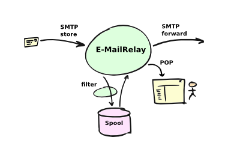
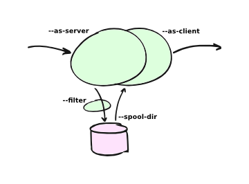
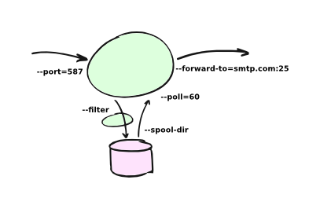
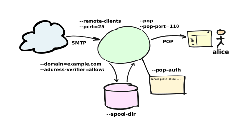
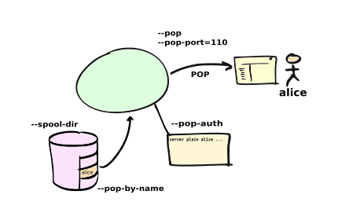

E-MailRelay User Guide
======================

What is it?
-----------
E-MailRelay is a lightweight [SMTP][] store-and-forward mail server with [POP][] access
to spooled messages. It can be used as a personal internet mail server using
SpamAssassin spam filtering and [DNSBL][] connection blocking, with incoming e-mail
delivered to [maildir][] mailboxes. Store-and-forward operation is normally to a
fixed smarthost but DNS MX routing can also be configured. External scripts can
be used for address validation and for processing e-mail messages as they
are received.

E-MailRelay runs as a single process using the same non-blocking i/o model as
Squid and nginx giving excellent scalability and resource usage.

The code has few dependencies on third-party libraries or run-time environments
so it is easy to build and install.

E-MailRelay is designed to be policy-free, so that you can implement your own
policies for message retries, bounces, local mailbox delivery, spam filtering
etc. through external scripts.

Basic operation
---------------
E-MailRelay can be run straight from the command-line, and on Windows you can
run `emailrelay.exe` or `emailrelay-textmode.exe` from the zip file without
going through the installation process.

To use E-MailRelay in store-and-forward mode use the `--as-server` option to
start the storage daemon in the background, and then do delivery of spooled
messages by running with `--as-client`.

For example, to start a storage daemon in the background listening on port 10025
use a command like this:

        emailrelay --as-server --port 10025 --spool-dir /tmp

On Windows use `c:/temp` for testing, rather than `/tmp`.

Or to run it in the foreground:

        emailrelay --log --no-daemon --port 10025 --spool-dir /tmp

And then to forward the spooled mail to `smtp.example.com` run something
like this:

        emailrelay --as-client smtp.example.com:25 --spool-dir /tmp

To forward continuously you can add the `--poll` and `--forward-to` options to
the server command-line:

For example, this starts a server that also forwards spooled-up e-mail every
minute:

        emailrelay --as-server --poll 60 --forward-to smtp.example.com:25

Or for a server that forwards each message as soon as it has been received, you
can use `--forward-on-disconnect`:

        emailrelay --as-server --forward-on-disconnect --forward-to smtp.example.com:25

To edit or filter e-mail as it passes through the server specify your filter
program with the `--filter` option, something like this:

        emailrelay --as-server --filter /tmp/set-from.js

Look for example filter scripts in the `examples` directory.

E-MailRelay can also be used as a personal internet mail server:

Use `--remote-clients` (`-r`) to allow connections from outside the local
network, define your domain name with `--domain` and use an address verifier as
a first line of defense against spammers:

        emailrelay --as-server -v -r --domain=example.com --address-verifier=account:

Then enable [POP][] access to the incoming e-mails with `--pop`, `--pop-port` and
`--pop-auth`:

        emailrelay ... --pop --pop-port 10110 --pop-auth /etc/emailrelay.auth

Set up the POP account with a user-id and password in the `--pop-auth` secrets
file. The secrets file should contain a single line of text like this:

        server plain <userid> <password>

For more information on the command-line options refer to the reference guide
or run:

        emailrelay --help --verbose

Configuration
-------------
After a full installation the E-MailRelay server will normally be started up
automatically when the machine boots up.

On Unix-like systems the server will read its configuration settings from a file
`/etc/emailrelay.conf`.

On Windows E-MailRelay typically runs as a Windows Service and it reads its
configuration from the startup batch file `emailrelay-start.bat` and/or
the configuration file `emailrelay.cfg` in the `ProgramData/E-MailRelay`
folder. (If you can't find this folder look for the `E-MailRelay` link in the
`Program Files/E-MailRelay` folder and then right-click and "open file
location".)

You can change the E-MailRelay server configuration by editing the configuration
file or startup batch file directly and then restarting the server. Or you can
use the E-MailRelay configuration GUI if it is available.

In many cases E-MailRelay will need to be configured with user-ids and
passwords. For example, if e-mail is being forwarded to a `smarthost` for onward
routing then you will need to supply the user-id and password for your account
on the smarthost. These details must be entered into a `secrets` file and then
one of `--server-auth`, `--client-auth` or `--pop-auth` must be used to point to
the file.

The E-MailRelay reference document describes the format of the secrets file.

Logging
-------
E-MailRelay is normally installed so that it logs its activity to a log file,
but it can also send logging information to `syslog` on Unix systems or the to
the Event Viewer on Windows.

Logging is configured with options like `--log`, `--log-file`, `--as-server` and
`--syslog`, so check these in the configuration file and/or startup batch file.

For more verbose logging add the `--verbose` option. This is a good idea when
setting up or trouble-shooting your E-MailRelay configuration.

Failures and retries
--------------------
If e-mail messages cannot be forwarded by the E-MailRelay system then the
envelope files in the spool directory are given a `.bad` suffix. The reason for
the failure will be recorded in the envelope file itself.

You should check for `.bad` envelope files in the E-MailRelay spool directory
from time to time. If you want failed messages to be retried then just remove
the `.bad` filename suffix. On Unix-like systems you can do this automatically
with a cron job that runs the `emailrelay-resubmit.sh` script occasionally.

Once a failed message has been renamed it will be forwarded along with all the
others. It is a good idea to use regular polling (eg. `--poll=60`) to make sure
that this happens in a timely manner.

Open mail servers
-----------------
If you are running E-MailRelay as an internet mail server then you need to be
careful about abuse by spammers and bot-nets. You will also need to be sure that
incoming e-mail messages are never automatically routed back out to the internet
because that will definitely attract abuse.

By default an E-MailRelay server will only accept connections from local network
addresses, so for an internet mail server you will need to add the
`--remote-clients` option. When you add `--remote-clients` you should be
sure that you have a firewall that blocks connections to any other ports that
E-MailRelay might have open, or use the `--interface` option to limit their
scope.

A good first step in limiting abuse is to use an address verifier that checks
that e-mails are correctly addressed to you. You can use the built-in address
verifier called `account:` to do this or you can write your own verifier script.

        emailrelay --as-server --remote-clients --address-verifier=account: --domain=mydomain.com

Refer to the `Address verifiers` section in the E-MailRelay reference document
for more details.

If you want to run an internet mail server that is not open to everyone then you
can require that remote users authenticate themselves. Do this with a secrets
file containing a user-id and password for every remote user, something like
this:

        server plain user1 password1
        server plain user2 password2

And then use `--server-auth` to point to the file:

        emailrelay --as-server --remote-clients --server-auth=/etc/emailrelay.auth

Refer to the `Authentication` section in the E-MailRelay reference document for
more details.

Running as a POP server
-----------------------
E-MailRelay can run as a [POP][] server so that an e-mail client program can
retrieve messages from the E-MailRelay spool directory.

To allow POP access use the `--pop` and `--pop-auth` command-line options,
something like this:

        emailrelay --as-server --pop --pop-auth=/etc/pop.auth

You will need to create the `--pop-auth` secrets file. It should contain one
line of text that gives the username and password that your e-mail client will
use when connecting to E-MailRelay, for example:

        server plain user1 password1

If you are using [POP][] to view a spool directory that is also being used for
e-mail forwarding then you should use `--pop-no-delete`.

If using more than one e-mail client program then you might want to make
independent copies of your e-mails for each client. Use a `--filter` program to
copy the e-mail files into sub-directories of the main spool directory and then
use `--pop-by-name` so that each e-mail client accesses its own sub-directory
according to which account name it used when authenticating. The filter can be
an external program, or just use the built-in `copy:` filter.

IMAP
----
E-MailRelay does not support the [IMAP][] protocol directly but a simple filter
script can be used to move e-mails into a [maildir][] directory and an IMAP server
such as [dovecot][] can be used to serve them from there.

It is normally sufficient for a filter script to just move the E-MailRelay
content file straight into the mailbox `cur` directory, delete the corresponding
envelope file and then exit with an exit code of 100. The built-in `deliver:`
filter can be used to do this.

Triggering delivery
-------------------
If you are using E-MailRelay on a Linux/Unix system to store and forward e-mail
over an intermittent link to the internet such as dial-up or wireless
networking, then you might need to arrange for E-MailRelay to be notified when
it can start forwarding e-mail.

You should find that there are special directories where you can install your
own hook scripts that are called whenever a dial-up or wireless network
connection is established. For dial-up this might be `/etc/ppp/ip-up.d`, and for
wireless `/etc/network/if-up.d`.

Just create a two-line script like this in the relevant directory:

        #!/bin/sh
        exec /usr/sbin/emailrelay --as-client=smtp.example.com:smtp

and make it executable using `chmod +x`.

You can also trigger forwarding from the E-MailRelay server via the `--admin`
interface.

Rate limiting
-------------
If you need to slow the rate at which e-mails are forwarded you can use a
`--client-filter` program to introduce a delay. On Windows this JavaScript
filter program would give you a delay of a minute:

        WScript.Sleep( 60000 ) ;
        WScript.Quit( 0 ) ;

However, this can cause timeouts at the server, so a better approach is to use
`--client-filter exit:102` so that only one e-mail message is forwarded on each
polling cycle, and then use `--poll 60` to limit it to one e-mail per minute.

SpamAssassin
------------
The E-MailRelay server can use [SpamAssassin](http://spamassassin.apache.org)
to mark or reject potential spam.

It's easiest to run SpamAssassin's `spamd` program in the background and let
E-MailRelay send incoming messages to it over the local network.

The built-in `spam-edit:` filter is used to pass e-mail messages to spamd:

        emailrelay --as-server --filter=spam-edit:127.0.0.1:783

If SpamAssassin detects a message is spam it will edit it into a spam report
with the original e-mail moved into an attachment.

Alternatively use the `spam:` filter if spam e-mails should be rejected
outright:

        emailrelay --as-server --filter=spam:127.0.0.1:783

Google mail
-----------
To send mail via Google mail's [SMTP][] gateway you will need to obtain a new
`application password` from Google: log in to your Google account and look for
the account's security settings and then `app passwords`. Create the password
for E-MailRelay selecting an application type `other`.

Then create a client secrets file for E-MailRelay containing your account name
and the new application password. You may already have this file on Windows as
`C:\ProgramData\E-MailRelay\emailrelay.auth`.

You should edit the secrets file to contain one `client` line, something like
this:

        client plain myname@gmail.com myapppassword

Then change the E-MailRelay configuration file to refer to your secrets file by
using the `--client-auth` option.

Also set the `--as-proxy` or `--forward-to` option to `smtp.gmail.com:587` and
add `--client-tls` to enable [TLS][] encryption.

On Windows your settings might look something like this in the `emailrelay.cfg`
configuration file:

        forward-to smtp.gmail.com:587
        client-tls
        client-auth C:/ProgramData/E-MailRelay/emailrelay.auth

In the startup batch file (`emailrelay-start.bat`) they should all go on one
line:

        start ... emailrelay --as-proxy=smtp.gmail.com:587 --client-tls --client-auth=C:/ProgramData/E-MailRelay/emailrelay.auth ...

Connection tunnelling
---------------------
E-MailRelay can send mail out via a [SOCKS][] v4 proxy, which makes it easy to route
your mail through an encrypted tunnel created by `ssh -N -D` or via the Tor
anonymising network.

For example, this will run an E-MailRelay proxy on port 587 that routes via a
local Tor server on port 9050 to the mail server at smtp.example.com:

        emailrelay --port 587 --as-proxy=smtp.example.com:25@localhost:9050 --domain=anon.net --anonymous --connection-timeout=300

Blocklists and dynamic firewalls
--------------------------------
E-MailRelay can consult with remote [DNSBL][] blocklist servers in order to block
incoming connections from known spammers. For example:

        emailrelay -r --dnsbl=zen.spamhaus.org,bl.mailspike.net ...

Refer to the documentation of the `--dnsbl` option for more details.

It is also possible to integrate E-MailRelay with intrusion detection systems
such as `fail2ban` that monitor log files and dynamically modify your iptables
firewall. Use E-MailRelay's `--log-format=address` command-line option so that
the remote IP addresses are logged and made visible to `fail2ban`.

Bcc handling
------------
E-MailRelay transfers e-mail messages without changing their content in any way,
other than by adding a `Received` header. In particular, if a message contains a
`[Bcc][]:` header when it is submitted to the E-MailRelay server it will have the
same `Bcc:` header when forwarded.

It is normally the responsibility of the program that submits an e-mail message
to submit it separately for each `Bcc` recipient, removing the `Bcc:` header
from the message content or changing it to contain only the 'current' recipient.
If this is not done, perhaps through misconfiguration of the e-mail user agent
program, then `Bcc` recipients may be visible to the `To` and `Cc` message
recipients.

An E-MailRelay `--filter` script can be used to reject messages with incorrect
`[Bcc][]:` headers, and an example script is included.

Advanced set-up
---------------
As an example of an advanced E-MailRelay setup consider the following
command-line, split onto multiple lines for readability:

        emailrelay
        --log --verbose --log-time --log-format=unit,network
        --close-stderr --syslog
        --pid-file @app/emailrelay.pid
        --user root

        --in-spool-dir @app/in
        --in-port 25
        --in-domain example.com
        --in-address-verifier account:
        --in-dnsbl dnsbl.example.com
        --in-filter spam-edit:127.0.0.1:783
        --in-filter deliver:
        --in-server-smtp-config +chunking,+smtputf8
        --in-size 100000000
        --in-pop
        --in-pop-port 110
        --in-pop-auth pam:
        --in-pop-by-name

        --out-spool-dir @app/out
        --out-port 587
        --out-forward-on-disconnect
        --out-forward-to-some
        --out-poll 60
        --out-address-verifier account:check
        --out-delivery-dir @app/in
        --out-filter deliver:
        --out-filter split:
        --out-client-filter mx:
        --out-forward-to 127.0.0.1:588
        --out-domain example.com

        --other-spool-dir @app/other
        --other-port 588
        --other-interface 127.0.0.1
        --other-client-tls
        --other-client-auth plain:YWxpY2VAZ21haWwuY29t:UGFzc3cwcmQ
        --other-forward-to smtp.gmail.com:587
        --other-poll 3600

This is a three-in-one configuration so there are effectively three E-MailRelay
servers running in one process, named `in`, `out` and `other`.

The `in` server is an internet-facing e-mail server with delivery to individual
mailboxes that can be accessed via [POP][]. The `account:` verifier checks the
addressees in the incoming e-mails against the list of accounts on the local
machine and against the given domain name; the IP address of the network
connection is checked against a [DNSBL][] database; SpamAssassin is used to
identify spam; and Linux [PAM][] is used for POP authentication.

The `out` server is a routing [MTA][] that sends outgoing e-mail messages directly
to destination servers. The filter makes copies so that each e-mail message goes
to just one domain. The client filter uses DNS MX queries against the local
system's default name servers to do the routing. If any e-mail messages are
addressed to local users they are short-circuited and delivered directly to
their `in` mailboxes.

The `other` server does store-and-forward to a gmail smarthost and acts as the
default destination for the `out` server. In this example the gmail password is
given directly on the command-line but it is normally more secure to use a
separate secrets file.

[Bcc]: https://en.wikipedia.org/wiki/Blind_carbon_copy
[DNSBL]: https://en.wikipedia.org/wiki/DNSBL
[IMAP]: https://en.wikipedia.org/wiki/Internet_Message_Access_Protocol
[MTA]: https://en.wikipedia.org/wiki/Message_transfer_agent
[PAM]: https://en.wikipedia.org/wiki/Linux_PAM
[POP]: https://en.wikipedia.org/wiki/Post_Office_Protocol
[SMTP]: https://en.wikipedia.org/wiki/Simple_Mail_Transfer_Protocol
[SOCKS]: https://en.wikipedia.org/wiki/SOCKS
[TLS]: https://en.wikipedia.org/wiki/Transport_Layer_Security
[dovecot]: https://www.dovecot.org
[maildir]: https://en.wikipedia.org/wiki/Maildir

_____________________________________
Copyright (C) 2001-2024 Graeme Walker
